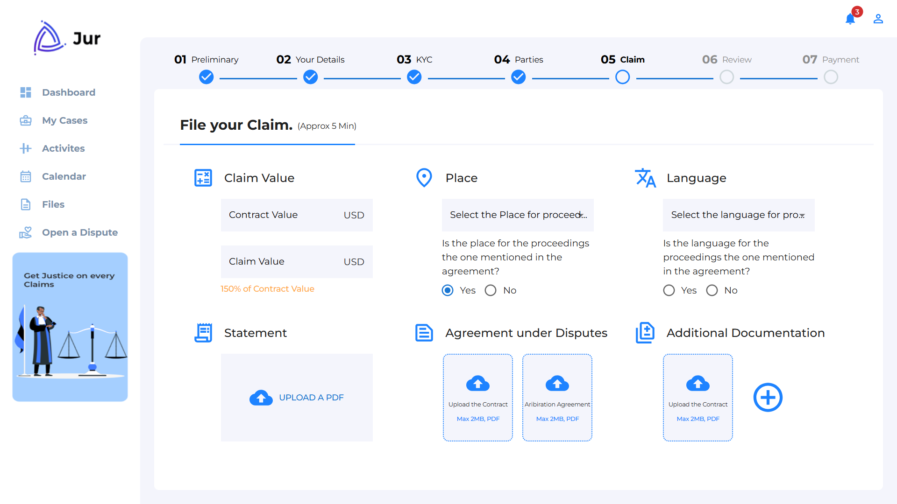
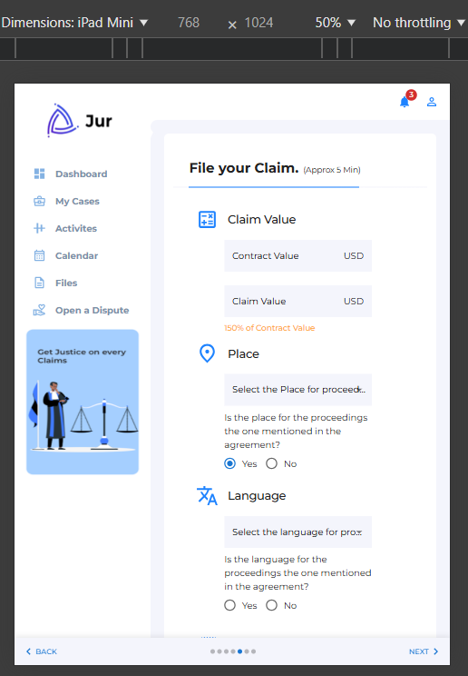
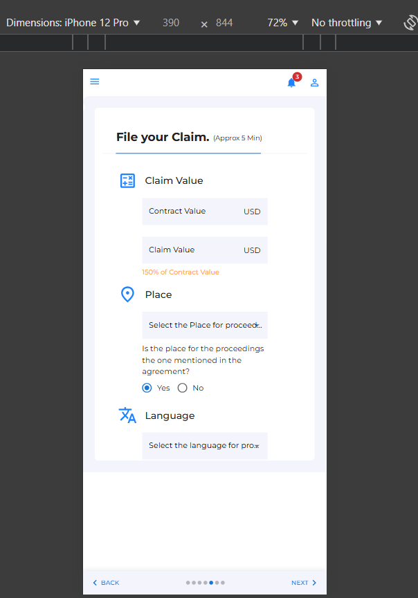

# Dashboard Replica

This project is a responsive dashboard built with React.js, replicating the design provided in the assignment. The dashboard features interactive elements, form validation, and a modular component structure. The application adapts to desktop, tablet, and mobile screen sizes to ensure a seamless user experience.

## Features

- **Responsive Design**: The dashboard adjusts its layout for desktop, tablet, and mobile views.
- **Form Validation**: Input fields are validated to ensure no empty submissions.
- **Dynamic Elements**: Includes interactive components like checkboxes, dropdowns, and file upload buttons.
- **Custom Stepper**: A custom stepper is created for desktop navigation, and Material-UI's MobileStepper is used for mobile navigation.

## Approach

1. **Design Replication**: 
   - Used React.js to replicate the provided dashboard layout closely.
   - Followed the structure of the original design, ensuring all visible components (navigation menu, progress bar, input fields, buttons) are included.
  
2. **Responsiveness**:
   - Applied CSS media queries and Material-UI's responsive design utilities to ensure the dashboard adapts to various screen sizes.
   
3. **Modular Components**:
   - Divided the layout into reusable components for easy maintenance and reusability.
   - Each section, such as the navigation menu, progress bar, and form elements, was modularized into its own component.

4. **Custom Stepper (Desktop)**:
   - I created a custom stepper to navigate between different sections of the dashboard for the desktop view. 
   - This custom stepper uses icons and labels for each step, with a dynamic flow that allows users to click on each step and navigate through the dashboard.
   - The active step state controls which section is visible, and the stepper smoothly transitions as users move through the sections.

5. **Material-UI MobileStepper (Mobile)**:
   - For the mobile view, I used Material-UI's `MobileStepper` with a "dots" variant to allow users to navigate between steps at the bottom of the screen.
   - This stepper features "Next" and "Back" buttons to move between sections and ensures the navigation is intuitive on smaller screens.

6. **Form Validation**:
   - Used React Hook Form to handle form validation.
   - Ensured all fields are validated before submission, with error messages displayed for invalid inputs.

## Challenges Faced and Solutions

- **Custom Stepper (Desktop)**:
  - One of the main challenges was creating a custom stepper for the desktop layout. I needed to ensure that users could navigate between different sections, and I wanted to keep the navigation intuitive and visually appealing.
  - I built a custom stepper with clickable icons, labels, and connectors, which would show the steps in a linear fashion. I used state management to dynamically display content based on the active step and provided smooth transitions when moving between steps.

- **Responsive Design**:
  - Ensuring the dashboard layout is responsive across different screen sizes was a challenge. To resolve this, I used CSS media queries and Material-UI’s responsive utilities to adjust styles for smaller screens, ensuring a consistent and user-friendly experience.

- **Form Validation**:
  - Handling complex form validation with multiple fields and different validation rules was another challenge. I used React Hook Form to manage form state and validation, making it easy to implement conditional validation rules.

## Assumptions

- The design provided was the primary reference for layout and functionality.
- The mobile and tablet views should follow a simplified layout compared to the desktop view but still maintain key functionalities.
- All form fields are required, with validation in place to ensure no empty submissions.

## Screenshots

- **Desktop View**: 
- **Tablet View**: 
- **Mobile View**: 

## Installation

To run the project locally, follow these steps:

1. Clone the repository:

   ```bash
   git clone https://github.com/abhiperfect/Rise11-dashboard
   ```

2. Navigate into the project directory:

   ```bash
   cd dashboard-replica
   ```

3. Install dependencies:

   ```bash
   npm install
   ```

4. Start the development server:

   ```bash
   npm run dev
   ```

Visit `http://localhost:5173/` to view the dashboard.

## Technologies Used

- **React.js**
- **Material-UI**
- **React Hook Form**
- **CSS / Material-UI for styling**
